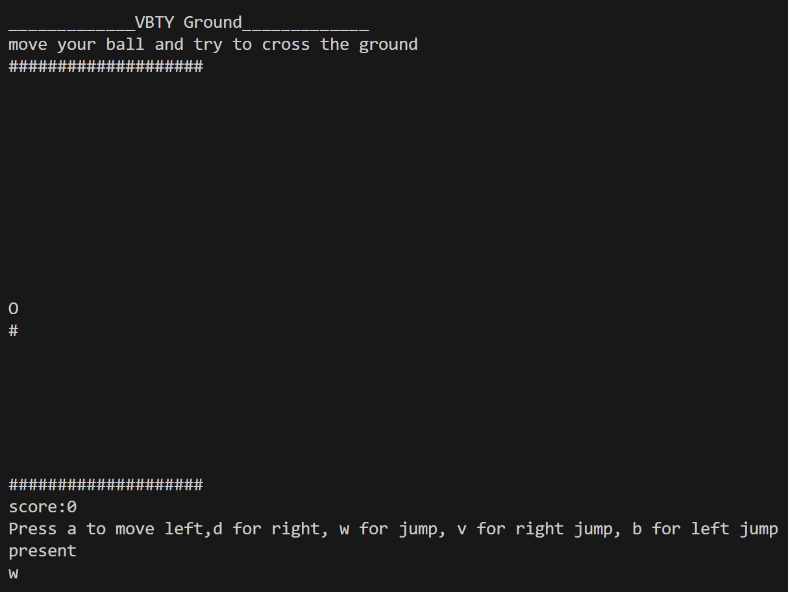

# Console Games

These are small cpp programs aimed to be a console game. Written from scratch.

## Bouncing ball (vbty)

Inn this game, their are blocks that move towards you and you have to try to go to opposite side.
by using a s d w v b and this increases your score.

Note -> This was written for windows machine.

## Asteriod field (qpzx)

In this game you have to move your ship using a s d w_
and protect it from the asteriods.

Start Screen:-

Gameplay:-

